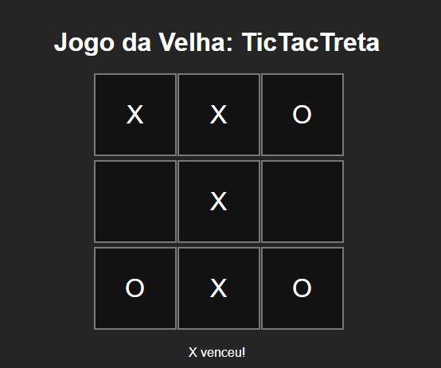

# 🎮 TicTacTreta

Um joguinho da velha (Tic Tac Toe) com bot lerdinho 🤖 feito em HTML, CSS e JavaScript!

## 🚀 Funcionalidades
- Player vs CPU (jogada aleatória)
- Interface simples e funcional
- Reinício rápido
- Layout responsivo

## 🧠 Tecnologias usadas
- HTML
- CSS (grid layout)
- JavaScript puro

## 📷 Print do jogo


## 💻 Como rodar

1. Baixe ou clone este repositório:
```bash
git clone https://github.com/teujoana/tictac-treta.git

2. Abra o arquivo "index.html" no navegador ou rode com alguma extensão tipo Live Server no VS Code. :D

Feito com 💚 por @teujoana
